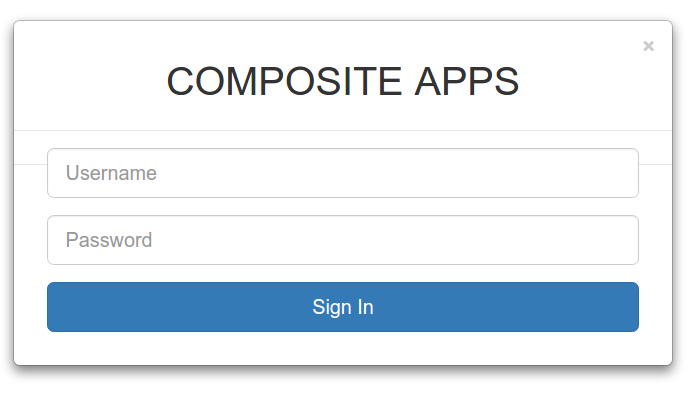
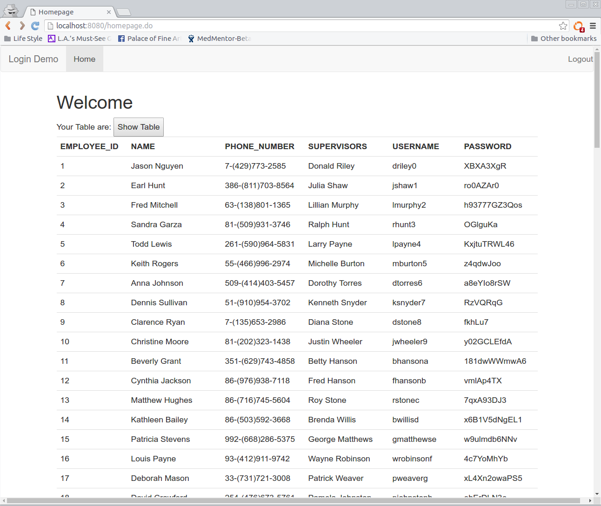

Java Servlet Login and Display
--------------------

Most web apps start with Login system and Display data.
This simple app serves those purposes.
Building backend with Tomcat 7 & MySQL 5 for simple Login system
and Display responsive Data Table with Bootstrap 3.

Installation
------------
+ Create MySQL database through script 'createtable_composite.sql' inside 'database' folder.
+ Import whole project into Eclipse & click Run As --> Maven build.

Version History
---------------

v0.12:
  + Fixed closing all database connections after each session use or logout.

Credit
-------
Basic interview project by http://www.compositeapps.net/

Support
-------
Developed by http://ntt2k.io
 -- Wed Mar 23 11:42:39 PDT 2016
